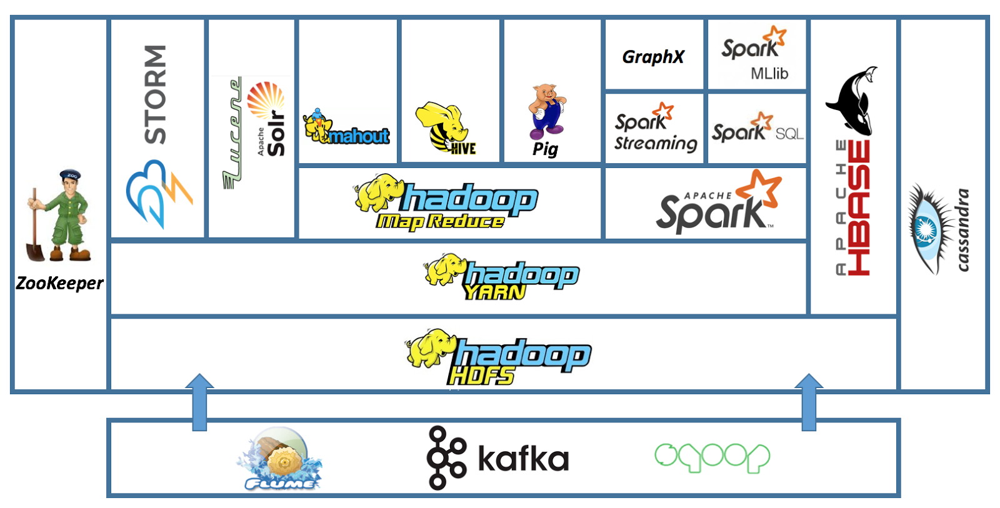

# Big data technologies
* **Hadoop/Spark ecosystem** - Hadoop, Hive, Apache Spark, Kafka and HDFS. (Tesla requirement)
* Spark, MapReduce, HDFS, Cassandra, Kafka (Apple)
* Snowflake 
* Google BigQuery
* AWS Redshift
* Presto 
* Druid 
* Apache Flink
* Kimball warehouse architecture
* Working experience with MPP systems (Snowflake, Spark SQL, Hive) and NoSQL systems (MongoDB, etc).

# Programming languages
* Python 
* Java 
* Scala 

# Good knowledge of 
## Purpose built databases:  
* relational (e.g. MySQL, PostgreSQL) 
* columnar (e.g. AWS Redshift) 
* in-memory (Redis) 
* key-value (ElasticSearch, Apache Cassandra) 
* optimization (e.g. Apache Calcite)

## data flow an storage
* Data pipelines (ETLs, real-time, low-latency data processing)
* Data storage formats (Parquet, OCR)
* Experience building platforms with either ECS or Kubernetes
* Familiarity with workflow management tools (Airflow).

# BI tools
* Domo
* Tableau
* Looker
* D3
* QuickSight (Amazon)

# Gloud based tech stack
* AWS or GCP

# Hadoop ecosystem

https://www.quora.com/How-do-I-learn-Apache-Spark  
https://okeanos.grnet.gr/home/  
https://dzone.com/articles/how-set-multi-node-hadoop   
https://cognitiveclass.ai/  
https://blog.ippon.tech/mongodb-and-apache-spark-getting-started-tutorial/  
